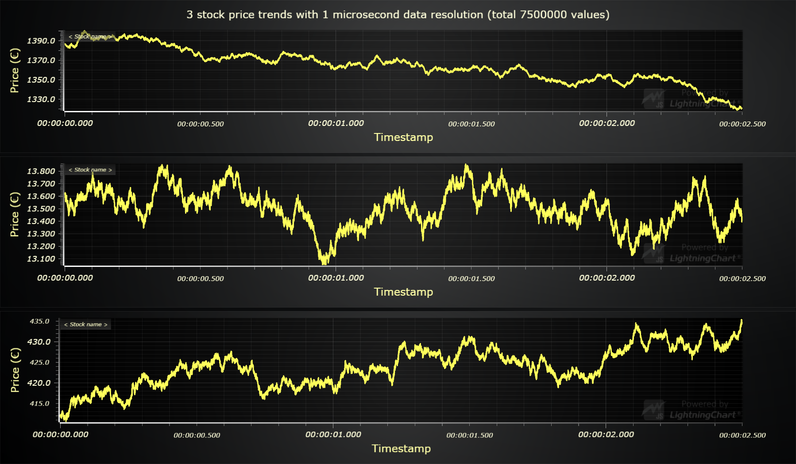

# JavaScript Ultra Precision Trading Chart

This demo application belongs to the set of examples for LightningChart JS, data visualization library for JavaScript.

LightningChart JS is entirely GPU accelerated and performance optimized charting library for presenting massive amounts of data. It offers an easy way of creating sophisticated and interactive charts and adding them to your website or web application.

The demo can be used as an example or a seed project. Local execution requires the following steps:

- Make sure that relevant version of [Node.js](https://nodejs.org/en/download/) is installed
- Open the project folder in a terminal:

        npm install              # fetches dependencies
        npm start                # builds an application and starts the development server

- The application is available at *http://localhost:8080* in your browser, webpack-dev-server provides hot reload functionality.

## Description

This example showcases how LightningChart JS can be used to enable next-generation Fintech chart applications.

As proven in our [2021 line charts performance comparison](https://www.arction.com/javascript-charts-performance-comparison/), LightningChart JS line charts are **over 700 times faster** than other web charts. LightningChart JS has been proved to be able to visualize data sets with even up to 500 million data points.

This large data plotting capacity paired together with great zoom capabilities enables some previously unseen possibilities in Fintech applications.

In this example, a random data set is generated for 3 stock price trends simulating a 1 microsecond resolution between each price measurement.
These trends are displayed with a shared X (time) view, showcasing an example on how analysis of incredibly high speed transactions and price impacts could be done in real life.

The amount of data in this example is 7 500 000 points. With 1 μs precision, this translates to 2.5 seconds of data per each trend.

As you can see, the data amount scales very quickly to crazy amounts. For this reason, this kind of visualization applications aren't applicable to entire data sets, but only to elsewhere identified "points of interest", such as turning points in trends.

To learn more about LightningChart JS and its Fintech capabilities, here are some potentially interesting links:

- [Next Generation Real-Time Trading Dashboard](https://www.arction.com/lightningchart-js-interactive-examples/examples/lcjs-example-0509-dashboardRealtimeTrading.html)

- [LC JS Trading + Indicators (Volume, RSI, SMA, EMA) Showcase with real trading data from alphavantage.co](https://arction.github.io/lcjs-showcase-trading/)

- [Candlestick, Area, DateTime features and more](https://www.arction.com/lightningchart-js-interactive-examples/examples/lcjs-example-0502-dashboardTrading.html)

- [Latest news on LC JS performance](https://www.arction.com/high-performance-javascript-charts/)

## API Links

* [Dashboard]
* [XY cartesian chart]
* [Line series]
* [Axis]
* [Axis tick strategies]
* [UI position origins]
* [UI layout builders]
* [Time formatting functions]
* [Synchronize axis intervals utility]
* [Translate point utility]

## Support

If you notice an error in the example code, please open an issue on [GitHub][0] repository of the entire example.

Official [API documentation][1] can be found on [Arction][2] website.

If the docs and other materials do not solve your problem as well as implementation help is needed, ask on [StackOverflow][3] (tagged lightningchart).

If you think you found a bug in the LightningChart JavaScript library, please contact support@arction.com.

Direct developer email support can be purchased through a [Support Plan][4] or by contacting sales@arction.com.

[0]: https://github.com/Arction/
[1]: https://www.arction.com/lightningchart-js-api-documentation/
[2]: https://www.arction.com
[3]: https://stackoverflow.com/questions/tagged/lightningchart
[4]: https://www.arction.com/support-services/

© Arction Ltd 2009-2020. All rights reserved.

[Dashboard]: https://www.arction.com/lightningchart-js-api-documentation/v3.3.0/classes/dashboard.html
[XY cartesian chart]: https://www.arction.com/lightningchart-js-api-documentation/v3.3.0/classes/chartxy.html
[Line series]: https://www.arction.com/lightningchart-js-api-documentation/v3.3.0/classes/lineseries.html
[Axis]: https://www.arction.com/lightningchart-js-api-documentation/v3.3.0/classes/axis.html
[Axis tick strategies]: https://www.arction.com/lightningchart-js-api-documentation/v3.3.0/globals.html#axistickstrategies
[UI position origins]: https://www.arction.com/lightningchart-js-api-documentation/v3.3.0/globals.html#uiorigins
[UI layout builders]: https://www.arction.com/lightningchart-js-api-documentation/v3.3.0/globals.html#uilayoutbuilders
[Time formatting functions]: https://www.arction.com/lightningchart-js-api-documentation/v3.3.0/globals.html#timeformattingfunctions
[Synchronize axis intervals utility]: https://www.arction.com/lightningchart-js-api-documentation/v3.3.0/globals.html#synchronizeaxisintervals
[Translate point utility]: https://www.arction.com/lightningchart-js-api-documentation/v3.3.0/globals.html#translatepoint

